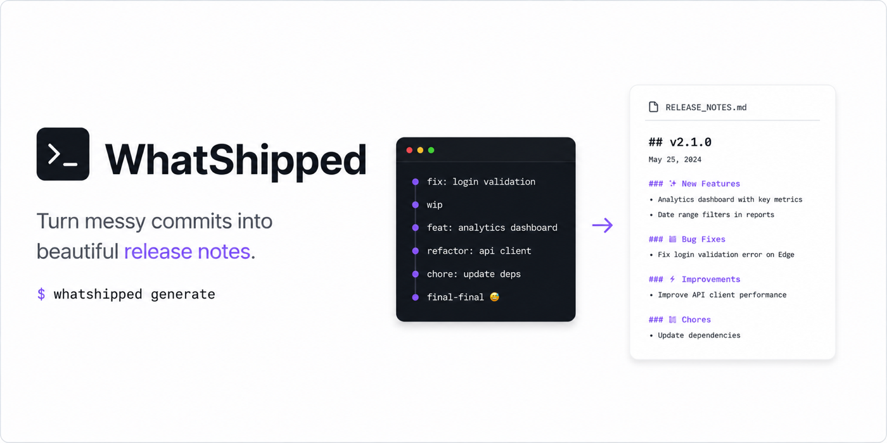

<p align="center">
  
</p>

<p align="center">
  <a href="https://www.npmjs.com/package/whatshipped"></a>
  <a href="https://github.com/ashishxcode/whatshipped/actions/workflows/ci.yml"></a>
  
  
</p>

# whatshipped

**What shipped last month?** Answer it in one command, across every service you run.

`whatshipped` reads the git history of all your repos and writes a
stakeholder-ready delivery report: what went live, in which service, on what
day — features separated from fixes, with cross-service launches detected
automatically.

Built for teams whose product spans several repos, where "what did we ship in
June" is a genuinely annoying question to answer.

Zero dependencies. Node 18+ and `git` are all you need.

```bash
npx whatshipped init ~/work --scan
npx whatshipped last
```

## Install

```bash
npm install -g whatshipped
```

Or run it straight from a clone:

```bash
git clone https://github.com/ashishxcode/whatshipped && cd whatshipped
npm link          # or just: node bin/cli.js
```

## Setup

```bash
whatshipped init
```

Interactive. It scans the current directory (or one you name), finds every git
checkout, works out which remote branch is actually live for each, and lets you
tick services in or out before writing `whatshipped.json`:

```
✓ found 9 checkouts under ~/work

Which services belong in the report? (9 found)
  ✓  1. billing-api      · origin/main · last commit 2026-07-25
  ✓  2. web-dashboard    · origin/main · last commit 2026-07-18
  ○  3. legacy-admin     · origin/main · last commit 2025-11-02

  enter = accept  ·  all  ·  none  ·  1,3 = keep only these  ·  -2 = drop #2
```

Scanning goes 3 levels deep by default, so nested layouts (`~/work/forked/api`)
are found too — tune with `--depth`. Repos idle for over a year are skipped.

Prefer no prompts?

```bash
whatshipped init ~/work --scan -y --org your-github-org
```

Then:

```bash
whatshipped last
```

### Setting up by hand

`whatshipped init` (no `--scan`) writes a blank template instead:

```jsonc
{
  "org": "your-github-org",        // used to clone services you don't have yet
  "defaultBranch": "origin/main",  // the branch that means "in production"
  "workspace": "~/work",           // where your checkouts live
  "searchPaths": [".", "forked"],  // subdirectories to look in, relative to workspace
  "cloneInto": ".",                // where missing services get cloned
  "repos": [
    { "name": "billing-api" },
    { "name": "marketing-site", "branch": "upstream/production" },
    { "name": "legacy-admin", "path": "~/other/place/legacy-admin" }
  ]
}
```

Per-repo `branch` and `path` override the defaults. Anything listed but not
found locally is cloned from `org` on first run.

Paths inside a config resolve relative to the config file, so a config committed
to a repo works the same on every machine.

**Config lookup order** — first hit wins:

1. `--config <file>`
2. `$WHATSHIPPED_CONFIG`
3. `./whatshipped.json`, walking up from the current directory
4. `~/.config/whatshipped/config.json` (written by `init --global`)

## Usage

```bash
whatshipped                      # this month
whatshipped last                 # last month — the usual monthly run
whatshipped 2026-07              # a specific month
whatshipped 2026-01..2026-07     # a range, with a month-by-month breakdown
```

| Option | Effect |
| --- | --- |
| `-o, --out <file>` | output path (default `./reports/shipped-<period>.md`) |
| `-c, --config <file>` | config file to use |
| `-r, --repos <a,b>` | only these services |
| `--no-fetch` | skip `git fetch`, use local refs as-is (fast, offline) |
| `--open` | open the report when it's written |
| `--stdout` | print instead of writing a file |

## What you get

```markdown
# June 2026 — Engineering Delivery Report

**Period:** 1 June 2026 – 30 June 2026  ·  **Scope:** 8 production services
·  **Shipped:** 97 changes (35 features, 62 fixes/improvements)

## Executive Summary
…

## Delivery by Service

| Service        | Features | Fixes/Chores | Total |
| -------------- | -------: | -----------: | ----: |
| billing-api    |        9 |           15 |    24 |
| web-dashboard  |        6 |           15 |    21 |

## Cross-Service Themes

| Theme                      | Services                              | Landed |
| -------------------------- | ------------------------------------- | ------ |
| **No Touch Negotiation**   | dashboard, server, admin, worker (4)  | Jun 18 |
```

Plus a per-month feature timeline and a full commit-level appendix per service.

## The narrative blocks

Numbers and tables are generated. The parts that need a human — **Executive
Summary**, **Headline Launches**, **Risks & Follow-ups** — live between markers:

```markdown
<!-- narrative:exec-summary -->
June delivered two major customer-facing capabilities…
<!-- /narrative:exec-summary -->
```

Re-running the command **carries your prose into the new report verbatim**. So
the monthly rhythm is: run it, write the summary once, and re-run freely as
late commits land. Empty a block to get the seeded draft back.

First run seeds all three from the data: cross-service launches become draft
headline rows, and Risks is populated from detected reverts, restores and
API-key/rate-limit churn.

## Privacy

Everything runs locally, against clones you already have.

- No telemetry, no analytics, no phone-home. The only network traffic is
  `git fetch` against your own remotes — skip even that with `--no-fetch`.
- Nothing is sent to any third party, including any AI service.
- Your `whatshipped.json` holds repo names and local paths. Generated reports
  contain commit subjects, PR numbers and dates — treat them as internal
  documents, and check before pasting one into a public issue or blog post.
- `whatshipped init` offers to add `whatshipped.json` and `reports/` to your
  `.gitignore` so neither is committed by accident.

## What counts

- **Shipped** = a non-merge commit on the service's live branch inside the window.
  `development → main` release merges are excluded, otherwise every change counts twice.
- **Feature** = subject starting `feat`, `refactor` or `migrate`
  (override with `featurePattern` in the config). Everything else is a fix/chore.
- **Cross-service theme** = the same normalised commit subject landing in more
  than one service — PR ref, prefix and punctuation stripped before comparing.

Two details that are easy to get wrong and are handled here:

- Window edges carry an explicit `T00:00:00`. Git fills a missing time-of-day
  from the *current clock*, which silently drags commits across month boundaries.
- Dates print with `--date=short-local`, the same zone git filtered in, so a
  commit never displays a date outside the month it was counted in.
- Months are bounded in **your local timezone**. A commit made at 00:30 IST on
  1 June is 31 May in UTC, so a teammate in another zone can see a
  boundary commit land in the adjacent month. If a distributed team needs
  byte-identical reports, pin it:

  ```bash
  TZ=UTC whatshipped last
  ```

## Releasing

CI runs the smoke test on Node 18/20/22 across Linux and macOS for every push.

Publishing is done by GitHub Actions, not from a laptop — which also sidesteps
npm's one-time-password prompt:

```bash
npm version patch     # or minor / major
git push --follow-tags
```

The tag triggers `.github/workflows/release.yml`, which re-runs the tests,
checks the tag matches `package.json`, publishes with provenance, and opens a
GitHub release.

Auth is either npm [Trusted Publishing](https://docs.npmjs.com/trusted-publishers)
(configure this repo + `release.yml` as a trusted publisher on npmjs.com — no
secret needed) or an `NPM_TOKEN` repository secret holding an npm automation
token.

## Layout

```
bin/cli.js      argument parsing and the run itself
lib/config.js   config discovery, loading, scaffolding
lib/scan.js     workspace scanning and live-branch detection
lib/git.js      git plumbing — resolve, fetch, log a window
lib/analyze.js  classification, themes, risk signals, rollups
lib/render.js   markdown, and the narrative-preservation logic
lib/prompt.js   dependency-free prompts for interactive setup
lib/ui.js       colour, spinner, symbols (honours NO_COLOR and CI)
```
